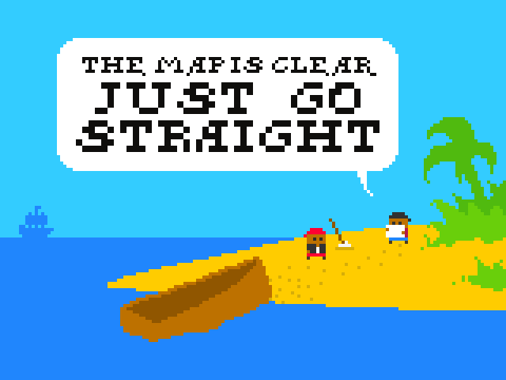

# Just go straight
---

[Js13kGames](http://js13kgames.com/) is a JavaScript coding competition for HTML5 Game Developers.
Theme for the 2017 competition is "*lost*".

---

The goal of the game is to find the treasure. The path to get it is simple, you just have to go straight.

The interest of the game resides on the bet that the player will never go straight on the first try. 
But as soon as they take another direction they are lost in the jungle and at every screen change, they get a better chance to get back to the beach so they have another chance to get it right. 

---

The code is compressed by uglify (automatically via webpack) and the images by TinyPNG (manually online).

Making games is not my job so this code is probably not something you want to learn from.
